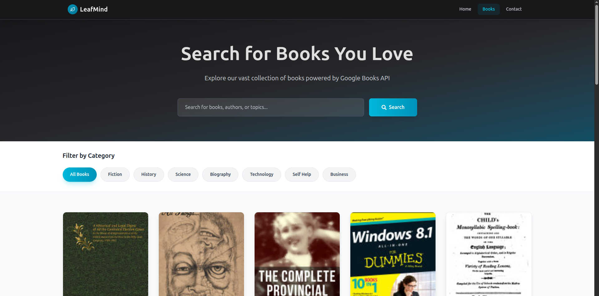

# LeafMind

LeafMind is a modern web application that allows users to search, explore, and discover books powered by the **Google Books API**. Built with **React, Vite, React Router, React Query, and Tailwind CSS**, it provides a fast, responsive, and user-friendly interface to browse books across multiple categories and view detailed information for each title.

## Features

* 🔍 **Book Search**: Search for books by title, author, or keywords.
* 📂 **Filter by Category**: Browse books across multiple categories (Fiction, History, Science, Technology, Business, etc.).
* 📑 **Book Details Page**: View in-depth details about a selected book including title, authors, description, and cover.
* 📖 **Pagination**: Navigate through search results with a smooth pagination system.
* ❤️ **Interactive UI**: Users can "favorite" or "bookmark" books for quick actions (UI only).
* ⚡ **Fast Performance**: Powered by **Vite** and optimized with **React Query** for efficient API data fetching and caching.
* 🎨 **Modern UI**: Styled with **Tailwind CSS** and responsive across devices.

## 🛠️ Tech Stack

* **Frontend Framework**: React (with Vite)
* **Routing**: React Router
* **Data Fetching & Caching**: @tanstack/react-query
* **Icons**: React Icons
* **Styling**: Tailwind CSS
* **API**: Google Books API

## 📂 Project Structure

```
src/
├── assets/               # Static assets (images, icons, etc.)
├── components/           # Reusable UI components
│   ├── Footer.jsx        # Footer page
│   ├── Navbar.jsx        # Website navigations
├── pages/                # Application pages
│   ├── Books.jsx         # Books listing & search
│   ├── BookDetails.jsx   # Individual book detail page
│   ├── Contact.jsx       # Contact page
│   └── Index.jsx         # Landing/Home page
├── App.jsx               # Main app component with routes
├── main.jsx              # React root and providers
├── index.css             # Global styles
```

## ⚙️ Installation & Setup

1. **Clone the repository**

```bash
git clone https://github.com/oluwaseyipd/LeafMind.git
cd leafmind
```

2. **Install dependencies**

```bash
npm install
```

3. **Start development server**

```bash
npm run dev
```

4. **Build for production**

```bash
npm run build
```

## 🔑 API Configuration

This project uses the **Google Books API**. By default, it works without authentication for basic requests. If you want higher request limits, you can set up an API key:

1. Create a project on Google Cloud Console.
2. Enable the **Books API**.
3. Generate an **API Key**.
4. Store it in your `.env` file:

```env
VITE_GOOGLE_BOOKS_API_KEY=your_api_key_here
```

5. Update your fetch requests to use the API key if needed.

## 📸 Screenshots

### Home Page


### Books Page


### Book Details Page


## 👩‍💻 Author

Developed by **Oluwaseyi** as ALX FE Program Capstone Project.

* Portfolio: [Oluwaseyi](https://oluwaseyiae.vercel.app/)
* LinkedIn: [Abiola John OLuwaseyi](https://www.linkedin.com/in/oluwaseyiae/)
* GitHub: [Oluwaseyipd](https://github.com/oluwaseyipd/)

## 📜 License

This project is licensed under the **MIT License**.

---

✨ **With LeafMind, finding your next favorite book has never been easier!**